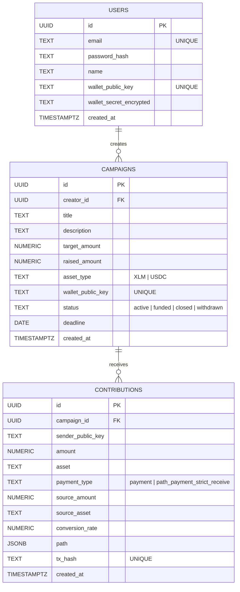

# Data Model

This document outlines the core foundational data models for CrowdPay: Users, Campaigns, and Contributions.

## Entities

- **Users**: Represents the platform users, including campaign creators.
- **Campaigns**: Represents funding campaigns created by users. Each campaign is tied to a specific target amount and asset on the Stellar network.
- **Contributions**: Represents individual payments made to a campaign. It handles path payment conversion details when applicable.

## Entity-Relationship Diagram

